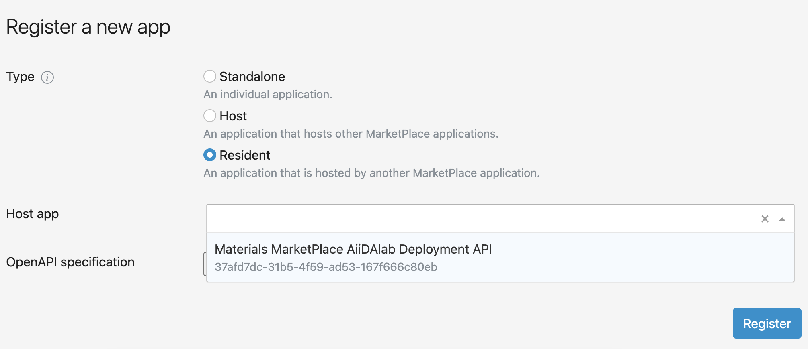

# Resident AiiDAlab app

## AiiDAlab registration

In order to register an AiiDaLab app on the platform, you first need to have the app registered in the AiiDAlab registry.
Please check the [AiiDAlab App developer guide](https://aiidalab.readthedocs.io/en/latest/app_development/index.html) to learn how to create your AiiDAlab app and publish it so it can be installed from [AiiDAlab's MarketPlace deployment](https://materials-marketplace.aiidalab.net/).

## MarketPlace registration

The registration process is the same as the one defined in [Application registration](./registration), with "_Resident_" app selected.

You can adapt the following OpenAPI specification for your app:

````{dropdown} Sample OpenAPI
```yaml
---
openapi: 3.0.0

info:
  title: dummy AiiDAlab App
  description: A dummy AiiDAlab app registered on the MarketPlace
  version: 0.1.0
  x-products:
    - name: AiiDAlab dummy app
servers:
  - url: https://materials-marketplace.aiidalab.net

paths:
  /user-redirect/apps/apps/home/open_app.ipynb?app=<dummy>&redirect=user-redirect/apps/apps/<dummy>/<nb>.ipynb:
    get:
      description: dummy App
      operationId: frontend
      security:
        - bearerAuth: []
      responses:
        "200":
          description: Success
        "404":
          description: Page not found

components:
  securitySchemes:
    bearerAuth:
      type: http
      scheme: bearer
      bearerFormat: JWT
```
````

For the host app, select the previously registered AiiDAlab platform application.


