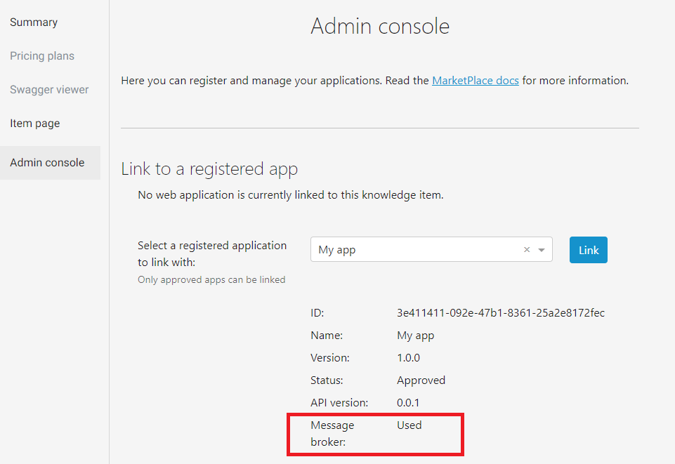

# Register an application behind a firewall

A message broker is offered to application providers to facilitate the integration of applications running in restricted network access in which direct communication from the outside world is blocked.

## RPC model

For this purpose, the MarketPlace employs a remote procedure call (RPC) model. The following provides an illustration of the RPC scheme in the context of the MarketPlace:


The platform itself takes the role of the client that acts on behalf of the user, whenever an operation is executed. In the example shown in the figure, the user asks to get a dataset with the ID 123. The MarketPlace recognizes that the application uses the message queue and therefore automatically pushes the request into the queue, without having the user to be aware of it. The application that acts as the server under the RPC model, will retrieve the message by polling the queue. Once the message is processed, its response will be pushed in the queue as well, but this is performed by the application. The platform will detect it and return it to the user.

## Configuration

An application provider that wishes to use the message broker, should simply specify the application server URL as `www.materials-marketplace.eu/message-broker`, as shown in the following snippet:

```yaml
servers:
  - url: https://staging.materials-marketplace.eu/message-broker
```

To verify the use of the message broker is recognized by the MarketPlace, you may check the indicator in the GUI:


Once set, the platform will automatically direct incoming requests into the message queue that could be consumed by the application. We provide an easy to follow example that could be adapted to your specific application:<br>
[https://github.com/materials-marketplace/python-sdk/blob/main/examples/rpc_server.py](https://github.com/materials-marketplace/python-sdk/blob/main/examples/rpc_server.py).
