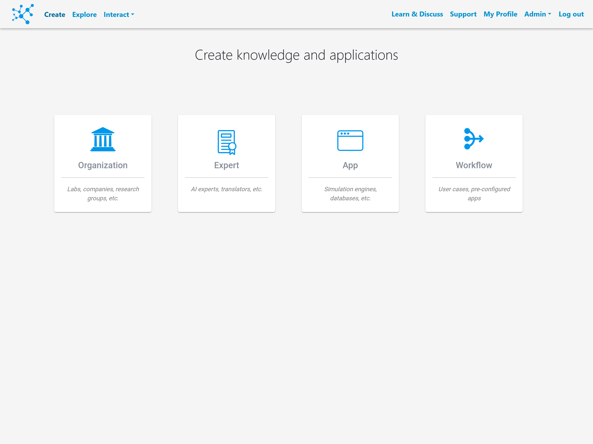
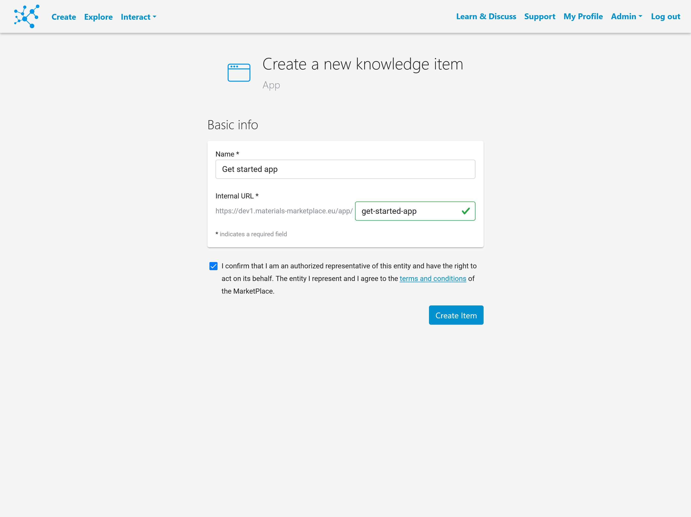
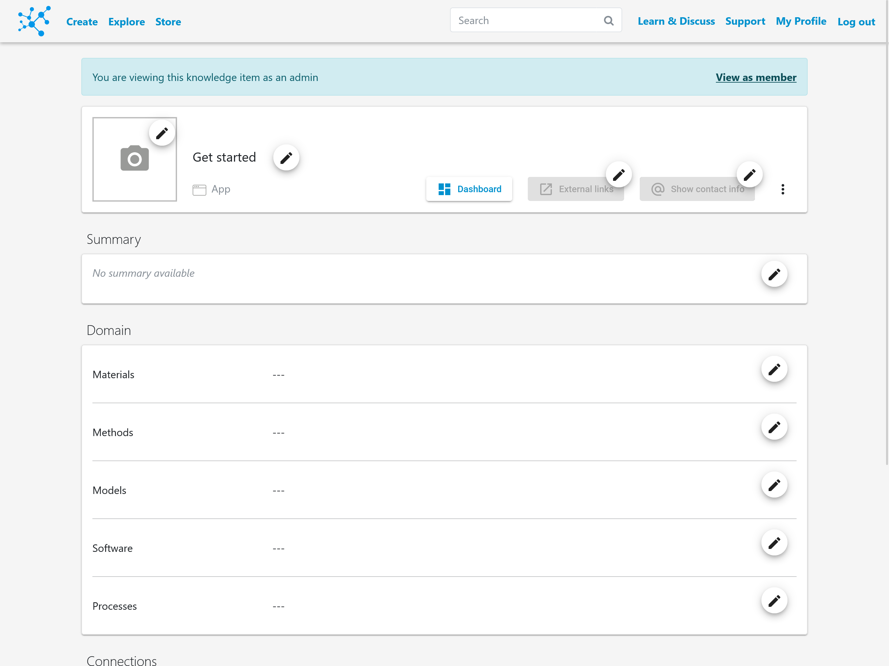
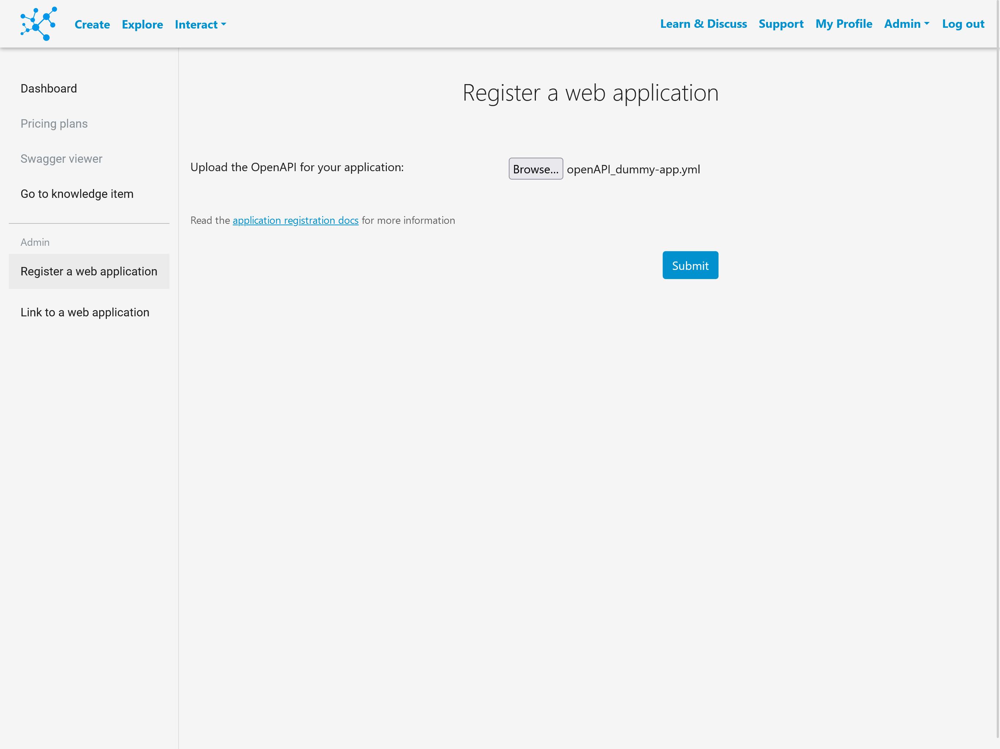
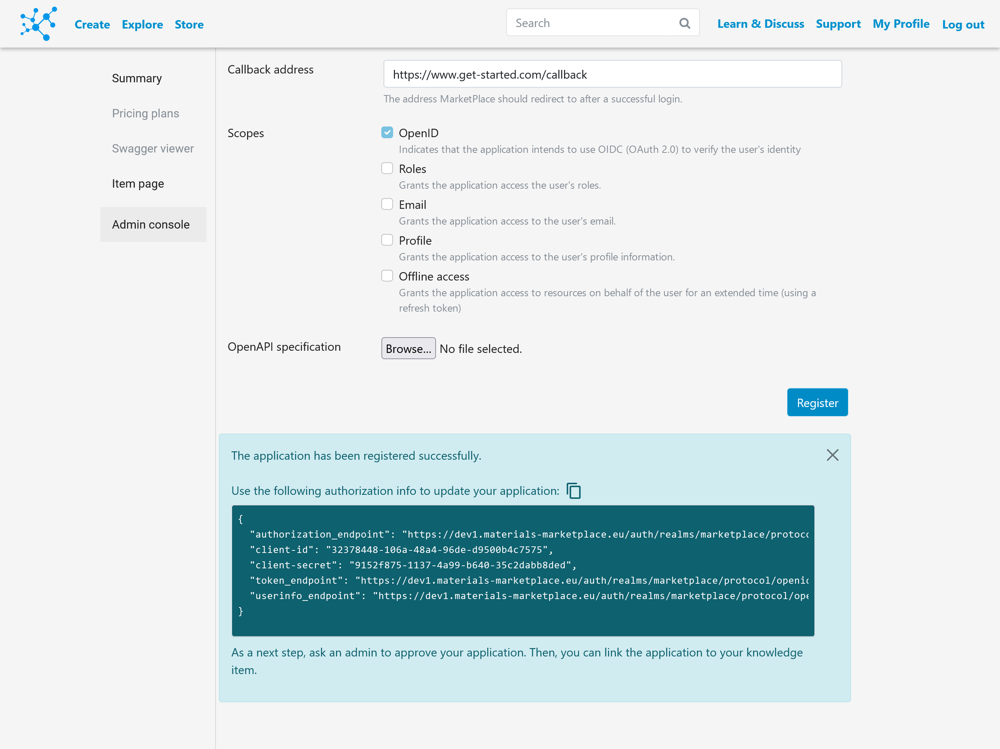
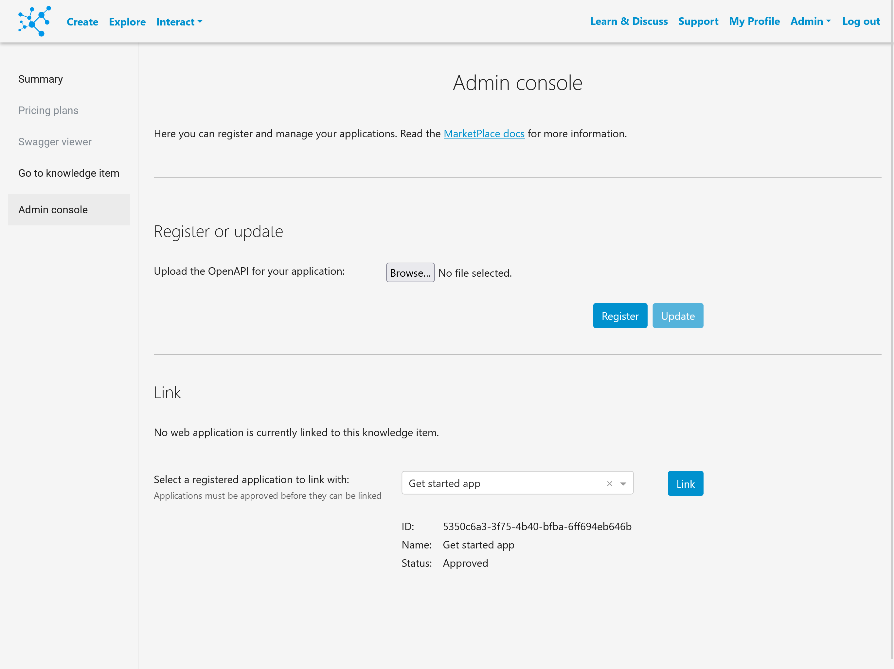
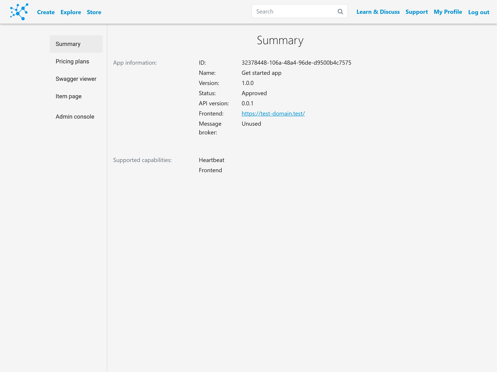
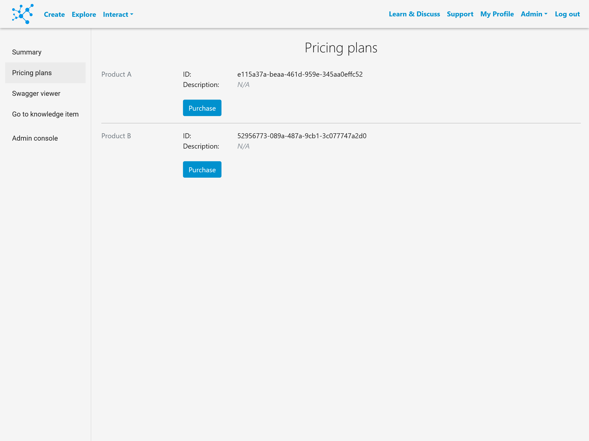
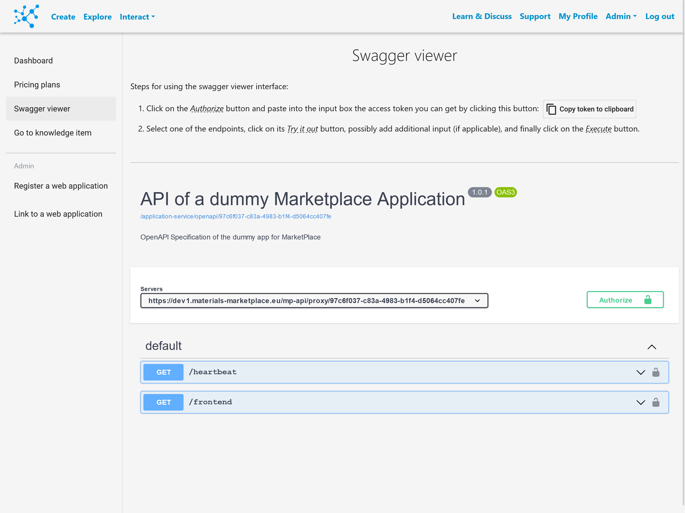

# How to register an application

This section will explain how to register an application to the MarketPlace platform.
To create your own, refer to the [get started app](https://github.com/materials-marketplace/get-started-app).

## 1. Create a knowledge item

All interconnected elements in the platform are represented by knowledge items.
Apps being one of those elements, the first step will be creating the corresponding item.

First, click on the "_Create_" option of the navigation bar and select the "_App_" item.



Next, define the name of your application, confirm that you have the rights to register such an application, and click on "_Create item_".



You will be redirected to the knowledge item admin page.
Here you can set the logo, a summary, metadata for classifying the application and connections to other knowledge items.
To proceed to the next step, click on "_Dashboard_".



## 2. Register application

In the "_Register a web application_" section of the left bar you can upload the file with the openAPI specification.
For more information on this file, refer to the [OpenAPI specification section](mp-api.md).



If the registration process is successful, you will be provided with some meaningful information for your application.



In the case that you have developed the application following a setup similar to the aforementioned dummy app, the `client_id` and `client_secret` should be used when you start your application server to enable the Single Sing On mechanism via the MarketPlace platform.

Next, a platform admin should approve the registration.
In the meantime, make sure that your application server is running and can be reached.

## 3. Link application

Once the application has been approved, it will be available for linking in the "_Link to a web application_" section.



Now the application information (client ID and capabilities) should be available in the "_Dashboard_".



To be able to use the application, one of the products should be purchased on the "_Pricing plans_" section.



## 4. Test application

You can directly test the communication with the newly registered application via MarketPlace on the "_Swagger viewer_".
The endpoints shown there are directly generated based on the uploaded openAPI file.



More information on swagger is available in the official [swagger documentation](https://swagger.io/docs/).

```{Important}
When communicating with the registered application via the MarketPlace, the query and path parameters of your application endpoint should always be sent as query parameters.

__Example 1__<br>
Application endpoint:<br><font style="color:gray">https://my-app.com/simulation/run/4f384c28-8671-4c7d-a6cf-22d127fc0866</font><br>
MarketPlace endpoint:<br><font style="color:gray">https://www.materials-marketplace.eu/mp-api/proxy/<CLIENT_ID>/start_transformation?transformationId=4f384c28-8671-4c7d-a6cf-22d127fc0866</font>

__Example 2__<br>
Application endpoint:<br><font style="color:gray">https://my-app.com/simulation/run?transformationId=4f384c28-8671-4c7d-a6cf-22d127fc0866</font><br>
MarketPlace endpoint:<br><font style="color:gray">https://www.materials-marketplace.eu/mp-api/proxy/<CLIENT_ID>/<CAPABILITY_NAME>start_transformation?transformationId=4f384c28-8671-4c7d-a6cf-22d127fc0866</font>
```

```{toctree}
:hidden: true
:maxdepth: 2

register_agent
```
