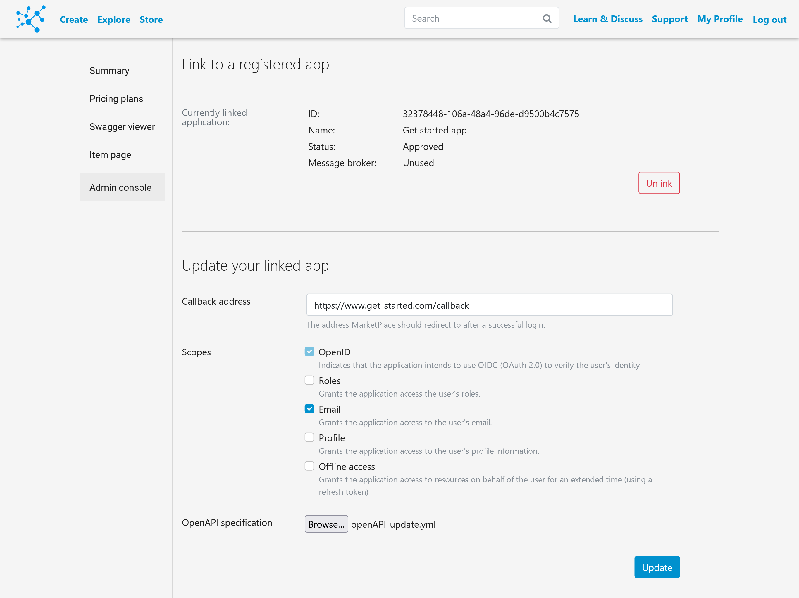
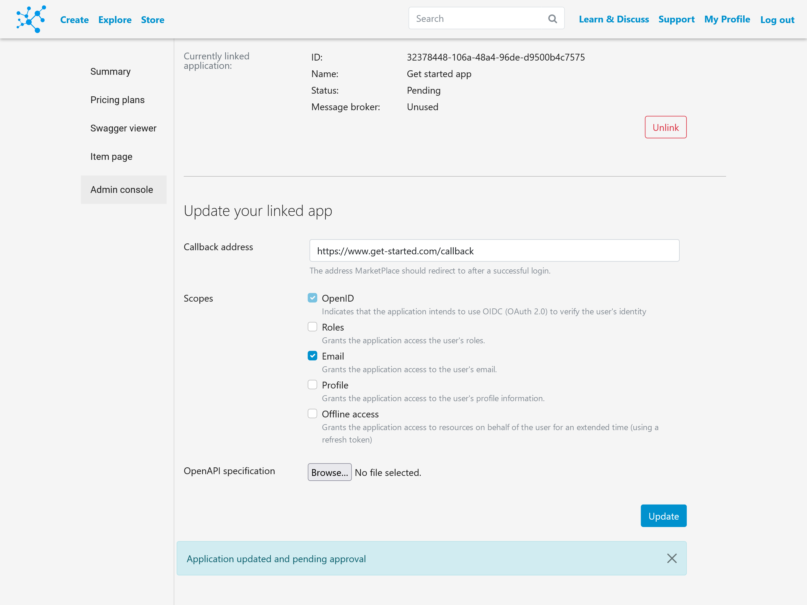

# Updating an application

Once an application has already been registered, it can be updated without having to change the client ID and client secret values.

## 1. Update the .yml file

The openAPI specification is now optional, in case only the callback or the scopes are modified.
Otherwise, the `version` field must be increased each time the application is updated.

If any products remain unchanged, their `product-id` should be included in the `x-products` description.

## 2. Update the application on the MarketPlace

Upload the new version of the openAPI specification in the _Admin console_ of your application:

If the process was successful, you will be informed:

