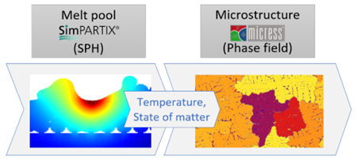
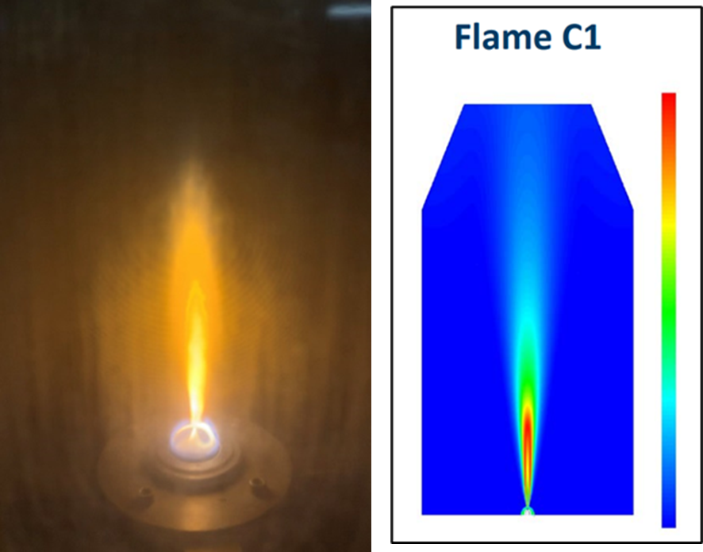
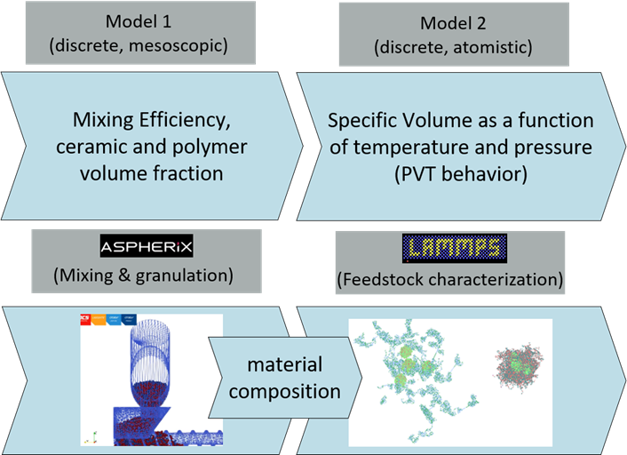

# Use cases

To deomonstrate industrially relevant use of the MarketPlace plattform a total of six use cases were developed. These were:

1. **Laser powder bed fusion L-PBF** [Use case 1](./uc1.md).
1. **Screen printing of solid oxide fuel cells** [Use case 2](./uc2.md).
1. **Nanoparticle production and catalst testing** [Use case 3](./uc3.md).
1. **Ceramic injection moulding for medical applications** [Use case 4](./uc4.md).
1. **Printing of Photovoltaic Thin Films** [Use case 5](./uc5.md).
1. **MatCalc demo** [Use case 6](./uc6.md).

Implementation details for each use case can be found by clicking the individual links.

Below we give a more prosaic overview of each of the use cases.

## Use case 1: Laser powder bed fusion for additive manufacturing of super-alloys

`Executing patners: MTU, Fraunhofer, ACCESS, ANSYS-Granta, EPFL`


## Use case 2: Screen printing of solid oxide fuel cells

`Executing patners: Bosch, DCS, ANSYS-Granta`


## Use case 3: Nanoparticle production and catalst testing

`Executing patners: JM, LUR, SINTEF, ANSYS-Granta`


## Use case 4: Ceramic injection moulding for medical applications

`Executing patners: HES, DCS, ANSYS-Granta`


## Use case 5: Printing of Photovoltaic Thin Films

`Executing patners: Crystalsol, UCL`


## Use case 6: MatCalc demo

`Executing patners: MBN, Fraunhofer`


```
some command line command
```
